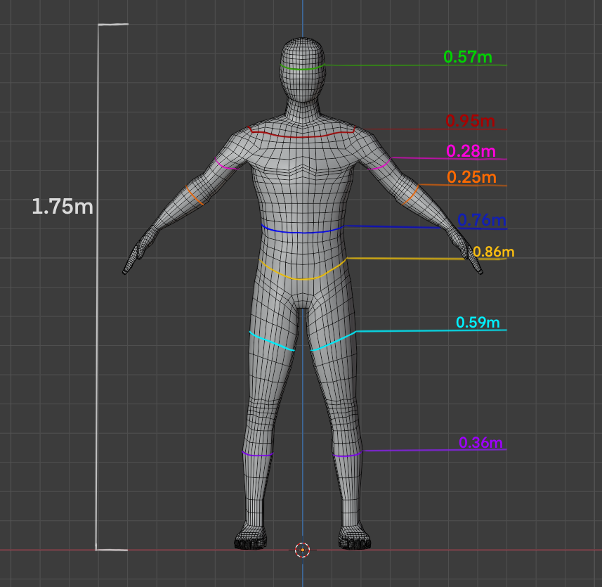
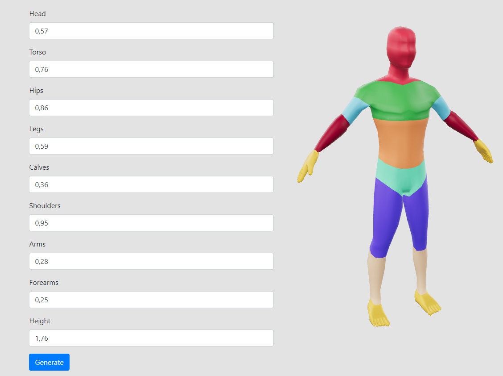

<h1 align = "center">  :computer: 🎓 3D Deformable Human Body for virtual fitting and other applications 🎓 :computer: </h1>

 A project for my internship at the VRLab, at University of Salerno 

 This project goal is to create a fully customizable 3D human body with your body measurements.
All that needs to be done is to enter the dimensions of the different body parts and it will generate a human body with those proportions for you.
The default body is generated with the measurements shown below. 

   

  

## How to run the project

Before getting started, make sure you have all of these installed on your computer:
- Python 3.7 or above
- Blender 2.9.0
- Any IDE but PyCharm is reccomended

Then, follow these steps: 
1. Clone this repository
2. Open <i>blenderinvoker.py</i> and change the <code>blenderPath</code> variable with the directory where you have Blender installed
3. Run <i>webserver.py</i>
4. Open <i>index.html</i> and it's done!

  

### Authors
* **Viviana Pentangelo** - [vipenti](https://github.com/vipenti)

